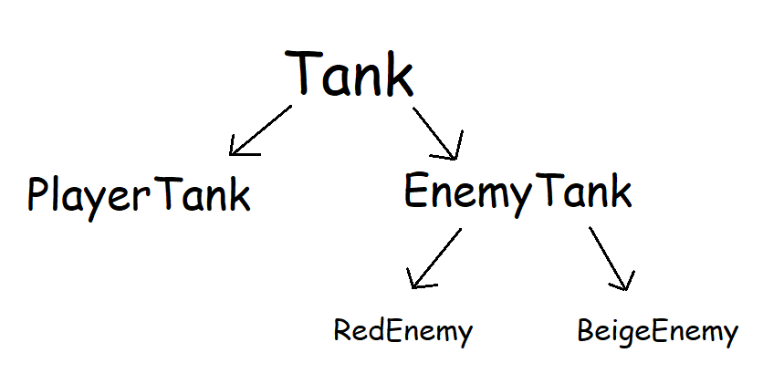

# Base Tank Feature Proposal
Implemented by Sam B.

## Planned Features
A generic `Tank` class that can be re-used when implementing both player-controlled and enemy tanks.

There are a couple of ways that we could implement these tank-related classes:

### Inheritance Strategy
One option is to use inheritance for some theoretical `PlayerTank` and `EnemyTank` and have them use methods set up in this class to implement their behavior. Different enemies might have different subclasses, and we will likely have some repeated code across our various `update` methods, since players rely on keyboard / mouse inputs and enemies do not.

If we pick this strategy, we would create a `Tank` class, then `extend` it with `PlayerTank`. Each enemy we choose to implement would likely also get its own class, or we could try to find ways to reususe pieces of functionality from one enemy to another.

Diagram:


This strategy would be relatively straightforward to implement, but is likely to lead to more code duplication (or heavy restrictions to try to curtail it).

### Composition Strategy
A different option would be to implement exactly one generic tank class and rely upon composition to create different varieties of behavior. Each instance of `Tank` would contain little classes we make up to control different parts of its behavior.   

Under this strategy, the `Tank` might have:
* a field `movementController`, an object that exposes methods that:
  * check if the tank should move 
  * if it is moving, return the direction the tank should move in
* a field `cannonController`, an object that exposes methods that:
  * update the tank's aiming direction
  * check if the tank should fire a bullet

To implement any specific kind of tank (player-controlled, enemy, etc.) we would implement new `MovementController` and `CannonController`-type classes. 

The `KeyboardMovementController` would use WASD keys to control the tank's movement, and `MouseCannonController` would use the mouse's position in its aim-updating method and check for mouse clicks to tell if the cannon should fire.

The `PassiveEnemyMovementController` might be used for very simple enemies. It periodically picks a direction, moves for a bit, then waits. The `DirectAimCannonController` is created with a reference to the object(s) it can target, if it has a clear line of sight to that target, it'll periodically fire bullets aimed directly at that target's current positon.

Creating enemies in this strategy can involve a bit of mix-and-match of different controllers. One enemy might combine the `DirectAim` controller with `PatrolMovement` to be more aggressive than the `Passive`/`Direct` combination described above.

Creating a certain variety of tank, enemy or player, would just require calling the generic `Tank` constructor and passing in the appropriate controllers. Static methods are a fine way to handle this:
```Haxe
static public CreateBeigeTankEnemy():Tank
```
or we could get even fancier and load information from a text file about different enemies - make the game "moddable" right out of the box.

Diagram:


This strategy is more complex to communicate about, and it is likely less intuitive to implement. It has potential to have nearly no redundant code, though the benefit maybe offset by the work it takes to implement.

## Additional Implementation details
Properties:
* health
* speed
* group of owned bullets
* aim direction (in degrees)
* [tank body graphic](../assets/images/tank_body_placeholder.png) (graphic loaded for this flxSprite)
* [tank cannon graphic](../assets/images/tank_cannon_placeholder.png) (a separate FlxSprite that sits on top of the tank body)

Methods:
* `aim(direction:FlxPoint)` - change aim direction and update cannon graphic to point toward the vector given by `direction`
* `shoot(direction:FlxPoint)` - if unused bullet is available, fire along the vector given by `direction`.
* `move(direction:FlxPoint)` - rotate graphic and set velocity to move along the vector given by `direction`.

The strategy we chooose to use for implementing our different types of tanks (either inheritance-based or composition-based) will impact this some too.

## How this Interacts with New Content
Player- and Enemy-Tank implementation directly depend on this work.

This will directly create and use Bullet objects after they're set up.

This will be used pretty heavily during level generation too, and logic for overlaps and collisions during gameplay depend on this existing.